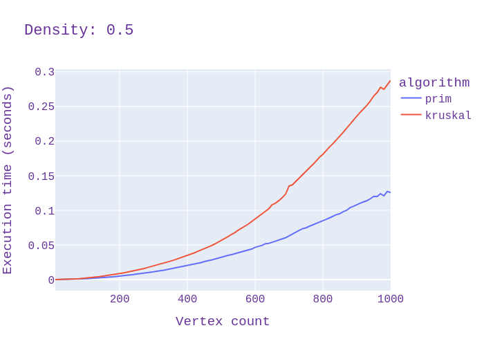
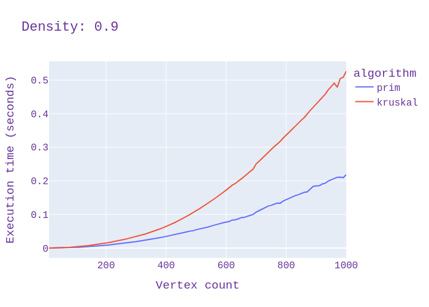

[](https://github.com/amytnyk/MST/actions/workflows/pylint.yml)
[](https://github.com/amytnyk/MST/actions/workflows/tests.yml)
## Minimum spanning tree algorithms comparison
### Introduction
The aim of this project is to compare 2 popular MST algorithms: Prim's and Kruskal's
### Prim's algorithm
Time complexity: Elog(V)
```python
def build_mst(graph: nx.Graph) -> nx.Graph:
    weights = [.0] + [math.inf] * (len(graph) - 1)
    mst = [None] * len(graph)
    visited = [False] * len(graph)
    edges_to_add = [(0, 0)]

    while edges_to_add:
        _, vertex = edges_to_add[0]
        heapq.heappop(edges_to_add)

        if visited[vertex]:
            continue
        visited[vertex] = True

        for _, node, data in graph.edges([vertex], data=True):
            weight = data['weight']
            if weight < weights[node] and not visited[node]:
                weights[node] = weight
                mst[node] = vertex
                heapq.heappush(edges_to_add, (weight, node))

    final_mst = nx.Graph()
    for i, u in enumerate(mst[1:]):
        final_mst.add_edge(i + 1, u)
    return final_mst
```
### Kruskal's algorithm
Time complexity: Elog(V)
```python
class DSU:
    def __init__(self, vertex_count: int):
        self.parents: List[int] = list(range(vertex_count))
        self.ranks: List[int] = [1] * vertex_count

    def union(self, node1: int, node2: int):
        node1, node2 = self.find(node1), self.find(node2)
        if node1 != node2:
            if self.ranks[node1] < self.ranks[node2]:
                node1, node2 = node2, node1
            self.parents[node2] = node1
            self.ranks[node1] += self.ranks[node2]

    def find(self, node: int) -> int:
        while self.parents[node] != node:
            node = self.parents[node]
        return node


def build_mst(graph: nx.Graph) -> nx.Graph:
    dsu = DSU(len(graph))
    mst = nx.Graph()
    for node_from, node_to, _ in sorted(graph.edges(data=True), key=lambda x: x[2]['weight']):
        component_from, component_to = dsu.find(node_from), dsu.find(node_to)
        if component_from != component_to:
            dsu.union(component_from, component_to)
            mst.add_edge(node_from, node_to)
    return mst
```
### Testing
#### Hardware specs
**OS**: Arch linux \
**RAM**: 16GB \
**CPU**: x86_64, 39 bits physical, 48 bits virtual, 12 CPUs, Intel(R) Core(TM) i7-10750H CPU @ 2.60GHz
Stepping: 2,
CPU max MHz: 5000.0000,
CPU min MHz: 800.0000
#### Info
The algorithms where tested 100 iterations on vertex range [10, 1000] with interval 10 (10, 20, 30, ..., 990, 1000) and densities [0.1, 0.5, 0.9].
Total of 100 * 3 * 2 * 100 = 60000 runs. From each 100 iterations the mean were chosen. All the results available at [results/results.csv](/results/results.csv)
#### Plots



### Results
We can clearly see that prim's algorithms run faster than kruskal's. Nevertheless, the difference between them is smaller in sparse graphs (density 0.1) and bigger in dense graphs (density 0.9)

So, we can conclude that it's always more efficient to use Prim's algorithm, even for sparse graph.

P.S. From given plots we can see that time complexity is near O(n<sup>2</sup>log(n)), and it's OK since E=*p**V<sup>2</sup>, where *p* is density of the graph
### Contributors
* Oleksii Mytnyk
* Dmytro Mykytenko